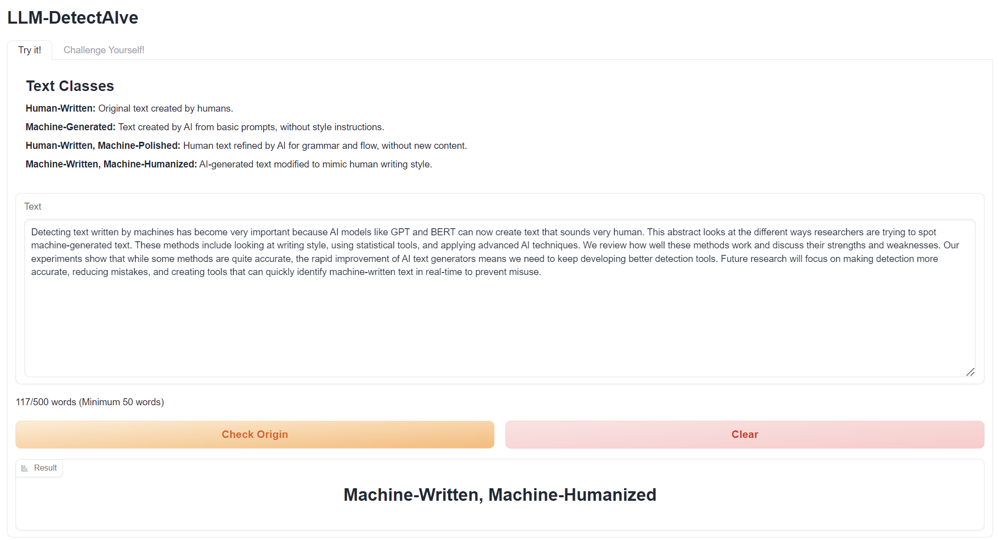
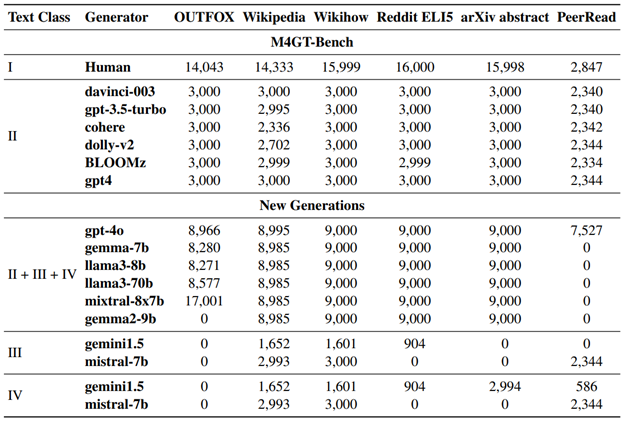

# LLM-DetectAIve

*A Tool for Fine-Grained Machine-Generated Text Detection*

<a href="https://arxiv.org/abs/2408.04284"></a>

<a href="https://huggingface.co/spaces/raj-tomar001/LLM-DetectAIve">
  
</a>

[Try it yourself!](https://huggingface.co/spaces/raj-tomar001/LLM-DetectAIve)

[Video demo](https://www.youtube.com/watch?v=E8eT_bE7k8c&feature=youtu.be)


---

## Overview  

LLM-DetectAIve is a system designed for fine-grained MGT detection. It is aims to classify texts from a variety of topics into four categories: human-written, machine-generated, machine-written machine-humanized, and human-written machine-polished.

LLM-DetectAIve can effectively identify the authorship of textual content, proving its usefulness in enhancing integrity in education, academia, and other domains. LLM-DetectAIve is publicly accessible on hugging face

---

## Demo Interface

The demonstration for LLM-DetectAIve has two tabs

### 1. Automatic Text Detection


    
Lets the user input any text (> 50 words) to get a prediction from LLM-DetectAIve.


### 2. Human Detector Playground


Lets the user see if they can correctly label data given a random sample text.

## Data Generated

Across LLMs over the four classes:  
I. Human-Written  
II. Machine-Generated  
III. Machine-Written Machine-Humanized  
IV. Human-Written Machine-Polished  
 



<!--  -->
For row II + III + IV, the data is approximately uniformly distributed across the three classes.


---


## Cite
If you use LLM-DetectAIve in your research cite as:
```bibtex
@inproceedings{abassy-etal-2024-llm,
    title = "{LLM}-{D}etect{AI}ve: a Tool for Fine-Grained Machine-Generated Text Detection",
    author = "Abassy, Mervat  and
      Elozeiri, Kareem  and
      Aziz, Alexander  and
      Ta, Minh Ngoc  and
      Tomar, Raj Vardhan  and
      Adhikari, Bimarsha  and
      Ahmed, Saad El Dine  and
      Wang, Yuxia  and
      Mohammed Afzal, Osama  and
      Xie, Zhuohan  and
      Mansurov, Jonibek  and
      Artemova, Ekaterina  and
      Mikhailov, Vladislav  and
      Xing, Rui  and
      Geng, Jiahui  and
      Iqbal, Hasan  and
      Mujahid, Zain Muhammad  and
      Mahmoud, Tarek  and
      Tsvigun, Akim  and
      Aji, Alham Fikri  and
      Shelmanov, Artem  and
      Habash, Nizar  and
      Gurevych, Iryna  and
      Nakov, Preslav",
    editor = "Hernandez Farias, Delia Irazu  and
      Hope, Tom  and
      Li, Manling",
    booktitle = "Proceedings of the 2024 Conference on Empirical Methods in Natural Language Processing: System Demonstrations",
    month = nov,
    year = "2024",
    address = "Miami, Florida, USA",
    publisher = "Association for Computational Linguistics",
    url = "https://aclanthology.org/2024.emnlp-demo.35",
    doi = "10.18653/v1/2024.emnlp-demo.35",
    pages = "336--343",
    abstract = "The ease of access to large language models (LLMs) has enabled a widespread of machine-generated texts, and now it is often hard to tell whether a piece of text was human-written or machine-generated. This raises concerns about potential misuse, particularly within educational and academic domains. Thus, it is important to develop practical systems that can automate the process. Here, we present one such system, LLM-DetectAIve, designed for fine-grained detection. Unlike most previous work on machine-generated text detection, which focused on binary classification, LLM-DetectAIve supports four categories: (i) human-written, (ii) machine-generated, (iii) machine-written, then machine-humanized, and (iv) human-written, then machine-polished. Category (iii) aims to detect attempts to obfuscate the fact that a text was machine-generated, while category (iv) looks for cases where the LLM was used to polish a human-written text, which is typically acceptable in academic writing, but not in education. Our experiments show that LLM-DetectAIve can effectively identify the above four categories, which makes it a potentially useful tool in education, academia, and other domains.LLM-DetectAIve is publicly accessible at https://github.com/mbzuai-nlp/LLM-DetectAIve. The video describing our system is available at https://youtu.be/E8eT{\_}bE7k8c.",
}
```
